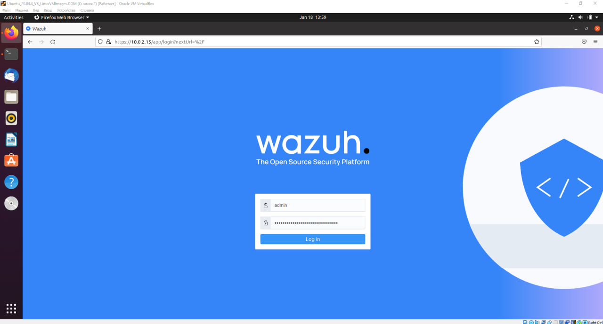
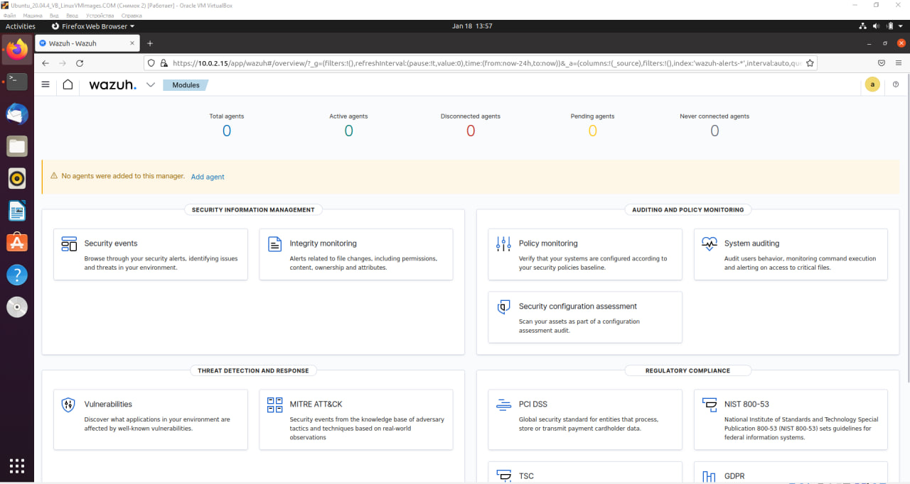

# Diplom

## Расследование инцидентов

> Изучить логи и примеры инцидентов, дать подробные ответы на данные вопросы:

[Link to SOC Questions](new-Diplom/docs/SOC%20Practical_.docx)

Ответы:

> [Link to SOC Answers](new-Diplom/docs/SOC%20Practical_%20Answers.docx)

## Создать скрипт на любом языке, который в информативном виде будет запускать скрипт с установкой:

* `AVML` - создание дампа оперативной памяти
* `Volatility` - фреймворк для работы с артефактами форензики
* `dwarf2json` - создание symbol table для кастомного ядра linux
* Сделает снимок Debug kernel для symbol table

Ответы:

> [Link to automatization script](new-Diplom/bin/scr1.txt)

```sh
#!/bin/bash

# 1. Устанавливаем необходимые пакеты
echo "[INFO] Installing necessary packages..."
sudo apt update
sudo apt install -y build-essential curl git python3-dev python3-pip python3-setuptools python3-wheel cmake unzip

# 2. Устанавливаем toml для работы с pyproject.toml
pip3 install toml

# 3. Устанавливаем AVML
echo "[INFO] Installing AVML..."
curl -LO https://github.com/volatilityfoundation/volatility3/releases/download/avml/avml
chmod +x avml
sudo mv avml /usr/local/bin/

# 4. Устанавливаем Volatility3
echo "[INFO] Installing Volatility3..."
git clone https://github.com/volatilityfoundation/volatility3.git
cd volatility3

# 5. Проверка наличия pyproject.toml и установка зависимостей
if [ -f "pyproject.toml" ]; then
  echo "[INFO] Found pyproject.toml. Installing dependencies using pip..."
  pip3 install .
else
  echo "[ERROR] pyproject.toml not found!"
  exit 1
fi

# 6. Установка dwarf2json
echo "[INFO] Installing dwarf2json..."
cd ~/Downloads || exit
if [ ! -d "dwarf2json-master" ]; then
    wget https://github.com/volatilityfoundation/dwarf2json/archive/refs/heads/master.zip -O dwarf2json.zip
    unzip dwarf2json.zip
    cd dwarf2json-master || exit
    go build -o dwarf2json main.go
    sudo mv dwarf2json /usr/local/bin/
else
    echo "dwarf2json уже загружен."
    cd dwarf2json-master || exit
fi

# Проверка установки dwarf2json
if dwarf2json --version; then
    echo "dwarf2json установлен успешно!"
else
    echo "Ошибка установки dwarf2json."
    exit 1
fi
# 7. Установка символической ссылки для удобства
echo "[INFO] Creating symbolic links..."
ln -s /home/ubuntu/.local/bin/vol /home/ubuntu/.local/bin/volatility3

# 8. Добавляем папку с бинарными файлами в PATH
echo "[INFO] Adding local bin to PATH..."
export PATH=$PATH:/home/ubuntu/.local/bin
echo 'export PATH=$PATH:/home/ubuntu/.local/bin' >> ~/.bashrc

# 9. Проверка установленных версий
echo "[INFO] Verifying installed versions..."
volatility3 --version || { echo "[ERROR] Volatility3 is not installed correctly"; exit 1; }
avml --version || { echo "[ERROR] AVML is not installed correctly"; exit 1; }
./dwarf2json --version || { echo "[ERROR] dwarf2json is not installed correctly"; exit 1; }

# 10. Завершаем установку
echo "[INFO] Installation completed successfully."
```

## Автоматизировать процесс проверки url через virustotal

> Напишите небольшой скрипт для автоматизированной проверки url. Можно использовать любой язык программирования

Ответы:

> [Link to the script](new-Diplom/bin/url.py)

```py
import requests
import json

# API ключ VirusTotal
api_key = "ВСТАВЬТЕ_СВОЙ_API_КЛЮЧ"

# URL для проверки
url = input("Введите URL для проверки: ")

# Отправка запроса на VirusTotal
headers = {
    "Accept": "application/json",
    "x-apikey": api_key
}
params = {
    "url": url
}
response = requests.post("https://www.virustotal.com/api/v3/urls", headers=headers, params=params)

# Проверка статуса ответа
if response.status_code == 200:
    # Получение данных из ответа
    data = json.loads(response.text)
    # Вывод результатов проверки
    print("Результаты проверки:")
    print("URL:", data["data"]["id"])
    print("Статус:", data["data"]["attributes"]["status"])
    print("Последнее обновление:", data["data"]["attributes"]["last_analysis_stats"])
    print("Результаты анализа:")
    for engine, result in data["data"]["attributes"]["last_analysis_results"].items():
        print(engine, ":", result["category"])
else:
    print("Ошибка:", response.status_code)


```

## Вы обнаружили уязвимость CVE-2021-41773 на вашем web сервере

> Вам необходимо создать задачу для IT по её устранению. Что нужно будет сделать специалисту, чтобы исправить эту уязвимость? Напишите plabook для специалиста SOC L1

[Link to CVE-2021-41773](https://nvd.nist.gov/vuln/detail/CVE-2021-41773)

Ответы:

> [Link CVE](new-Diplom/docs/CVE-2021-41773.docx)

## Установить SIEM систему (на ваше усмотрение Wazuh, ELK\EFK, cloud splunk)

Загрузите и запустите помощник установки Wazuh.

```bash
curl -sO https://packages.wazuh.com/4.7/wazuh-install.sh && sudo bash ./wazuh-install.sh -a
```

**Авторизация**


**Домашняя страница**



